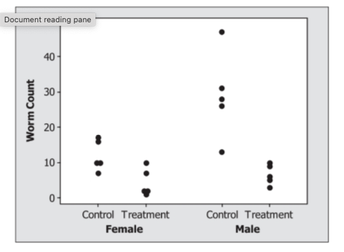
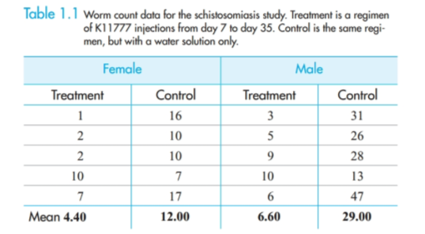
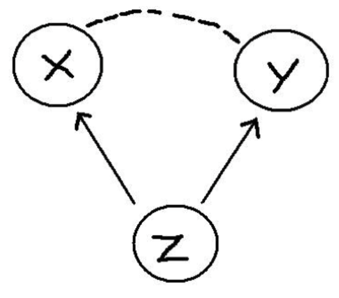

```{r child = "setup.Rmd"}
```

```{r packages, echo=FALSE, message=FALSE, warning=FALSE}
library(tidyverse)
#library(rvest)
library(janitor)
```

class: middle, center

# Chapter 1: Nonparametric Methods: Schistosomiasis

---

# AE-CH1

+ Navigate to course Github page
+ Open AE-CH1.qmd and copy contents
+ Create new .qmd in your MATH_350 project folder and paste contents from GitHub
+ Render your .qmd

---

# Case study: Schistosomiasis

+ Schistosomiasis (skis-tuh-soh-mahy'-us-sis) is a potentially deadly disease in humans caused by parasitic flatworms
+ Affects about 200 million people worldwide, serious in sub-Saharan Africa, South America, China, and Southeast Asia

**Research question: Can new drug K11777 prevent schistosome worms from growing?**

**Research design:**

+ 10 female lab mice, 10 male lab mice deliberately infected with the parasitic worms

--

+ 7 days after infection, each injected every day for 28 days
    + Within each sex, 5 randomly assigned to receive K11777 injections
    + Control group got equal volume water injection
+ Response variables: # of eggs and # of worms in their livers, on day 49
    + both expected to be lower if drug was effective
    
---

# Data

.pull-left[
```{r}
#| label: load-data
#| message: false
#| warning: false

mice <- read_csv("./data/C1 Mice.csv") %>% 
  clean_names()
mice
```
]

.pull-right[
```{r, echo=FALSE}

```

+ What do you notice / wonder?
+ What conclusions can we draw from this? What else (if anything) do we need to know/investigate? 

]

---

# Analysis

+ What analysis is appropriate here? Are the assumptions reasonably met? 

--

+ This is a really small sample size to be making distributional assumptions! E.g. CLT requires n > 30

--

+ Most of what you've learned about (inferential) statistics has been a **parametric** approach. 

+ **Parametric** means we assume the data come from a population that follows a probability **distribution** (or use CLT) in order to conduct a test or construct a confidence interval (e.g. t, F, chi-squared)

--

+ **Non-parametric** tests do NOT require assumptions about a distribution OR large sample sizes (e.g. for CLT) to make inferences

+ **Randomization test** is an example of a non-parametric method. It's a significance test that simulates the random allocation of units to treatments many times in order to determine the likelihood of observing an outcome at least as extreme as the one found in the actual study.

---

# Randomization test

.pull-left[
$$H_0: \text{random chance alone}$$

$$H_A: \text{real difference}$$

Reasons contributing to variability:

+ Number of parasitic worms in the liver naturally varies from mouse to mouse
+ Whether or not the drug is effective, there is clearly variability in the responses of mice to the infestation of schistosomes
+ Each group exhibits this variability, and even if the drug is not effective, some mice do better than others

]

.pull-right[
```{r, echo=FALSE}

```
Null hypothesis claims that the ONLY explanation for the observed difference of 7.6 worms in the means is that the random allocation placed mice with larger # of worms in the control group and mice with smaller # of worms in the treatment group (just due to chance - making it seem like there is a difference when there's not one)

]


---

# Fundamental question for inference

BOTH parametric and non-parametric procedures are based on the question: "How does what we observed in our data compare to what would happen if the null hypothesis were actually true and we repeated the process many times?"

--

For randomization tests, this question takes the form: "... compare to what would happen if the treatment actually had no effect on the individual responses and we repeated the random allocation of individuals to groups many times?"

---

# By hand simulation

+ Write the 10 female worm counts on 10 index cards
+ Shuffle the cards and draw 5 at random. 
    + These are the treatment group. 
    + Record the treatment group mean
    + Record the control group mean (the 5 cards you didn't draw)
    + Calculate the difference in means
+ Repeat the previous step 4 more times (end with a total of 5 simulated differences in means)
+ Plot your 5 differences in means as a dotplot on the board

--

**Empirical p-value**: How often (what proportion) did we observe a difference of 7.6 or larger? 

---

# Analysis in R

.pull-left[
```{r}
mice
```
]

.pull-right[
```{r, echo=FALSE}

```

+ What form does the data need to be in to create this visualization? What code do we need?
 
]

---

# Permutation Test

In observational studies, subjects are not randomly assigned to groups. In these situations, we perform the same inferential procedure but call it a **permutation test** instead of a randomization test, and the results cannot be used to claim causality. [See notes at end of slides / AE for a discussion about WHY]

**Permutation tests** don't assume normality. However, the null hypothesis does assume the two samples are taken from two populations that are similar. So if the two variances are very unequal, the p-value from a permutation test may not be very reliable. In this case, a t-test is better (allows for unequal variances). 

---

# Age Discrimination Study

+ Westvaco is a company that produces paper products
+ In 1991, Robert Martin sued the company for age discrimination after he was laid off from a job in the engineering department

+ Ages of the 10 people in department: 25, 33, 35, 38, 48, 55, 55, 55, 56, 64
+ Ages of people laid off: 55, 55, 64

```{r}
#| message: false
#| warning: false
#| echo: false

age <- read_csv("./data/C1 Age.csv") %>% 
  clean_names()
#glimpse(age)

ggplot(age, aes(x = age, y = layoff)) +
  geom_jitter(height = 0.05, alpha = 0.5, size = 5) +
  theme_minimal()
```

---

# Randomization test for matched pair design

A **matched pair** design is when each subject receives both the treatment and control conditions, and the response variable of interest is the *difference* between the two observations for each subject.

--

For example, in the color distractor experiment from Chapter 2, this would mean each person would play the color distractor version AND the standard version. 

--

A randomization test can be employed by randomly assigning a 1 or -1 to the computed differences (randomizes the order in which they get subtracted). 

```{r, echo = FALSE}
example <- data.frame(ID = 1:5,
                      color_time = c(36, 42, 37, 38, 35),
                      standard_time = c(38, 35, 32, 38, 37)) %>% 
  mutate(diff = color_time - standard_time,
         rand = c(1, -1, 1, 1, -1),
         diff_rand = diff*rand)
example
```

---

# Permutation test

$$H_0: \text{no relationship between age and layoff (result just due to chance alone)}$$
$$H_A: \text{relationship between age and layoff (result NOT due to chance alone)}$$

To simulate $H_0$ in a permutation test, we can randomly permute the labels "no" and "yes" for the `layoff` variable

[AE-CH1, 17-18]

*Note: a permutation test can also be used on a matched paired design using similar logic to the randomization test for a matched paired design*

---

# A deeper dive into causal claims

Randomized experiments allow us to make CAUSAL CLAIMS (x caused y)

--

If our data is simply observational (no random assignment), we CANNOT make causal claims (x is associated with y)

Why?? 

--

Randomization protects against potential confounding variables

But is it really that big of a deal??

---

# Omitted variables

.pull-left[

We have to be very careful not to make unwarranted causal claims from observational data, because there may be an omitted variable (Z), also known as a confounder.

Some examples:

+ There is a positive relationship between sales of ice cream (X) from street vendors and crime (Y). Does this mean that eating ice cream causes increased crime? 

+ Students that play an instrument (X) have higher grades (Y) than those that do not. Does this mean that playing an instrument causes improved academic outcomes? 

+ Countries that eat a lot of chocolate (X) also win the most Nobel Prizes (Y). Does this mean that higher chocolate consumption leads to more Nobel Prizes?

]

.pull-right[
```{r, echo=FALSE}

```
]

---

# Magic of Randomization

If omitted variables / confounders are such a threat to determining causality in observational data, why aren’t they also a threat in randomized experiments?

--

The answer is simple: randomization. Because people are randomized to treatment and control groups, on average there is no difference between these two groups on any characteristics other than their treatment.

--

This means that before the treatment is given, on average the two groups (T and C) are equivalent to one another on every observed and unobserved variable. For example, the two groups should be similar in all pre-treatment variables: age, gender, motivation levels, heart disease, math ability, etc. Thus, when the treatment is assigned and implemented, any differences between outcomes can be attributed to the treatment.

---

# AE-CH1

Demo, starting with "Randomization Example" section. 
