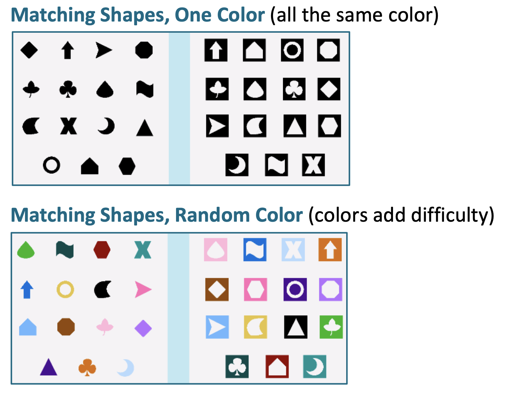

```{r child = "setup.Rmd"}
```

```{r packages, echo=FALSE, message=FALSE, warning=FALSE}
library(tidyverse)
library(rvest)
library(janitor)
```

class: middle, center

# Chapter 2: Making connections: The Two-Sample t-Test, Regression, ANOVA

---

# AE-CH2

+ Create MATH_350 Project in RStudio
+ Download Github starter files
+ Run code in install_packages.R
+ Open AE-CH2.qmd

---

# Case study: Distractors & Game Performance

+ Psychology research: slower to identify ink colors when ink was used to spell a different color
    + $\color{#990000}{\textbf{yellow}}$             
    + $\color{#990000}{\textbf{red}}$
    
--

+ The *automatized behavior* of reading interfered with the task of identifying ink color, slowed reaction time
+ "Stroop effect" (John Stroop, 1935)

--

+ Research question: Do students perform differently when distracting colors are incorporated into a computerized game?

--

```{r, echo=FALSE, out.width="30%"}

```
---

# Experimental set-up:

+ 40 students randomly sampled
+ 20 randomly assigned to no color distractor, 20 to color distractor version of the game
+ Both groups see picture & have rules clearly explained before playing
+ Play in same area with similar background noise to control for other possible distractions
+ Response variable: time in seconds from "start" to when they complete the game

--

```{r}
#| label: load-data
#| message: false
#| warning: false

games1 <- read_csv("./data/C2 Games1.csv") %>% 
  clean_names()
```

```{r}
glimpse(games1)
```

---

# AE-CH2 #1-4

---

# Three Analysis Approaches

1. Econ major suggests regression: y = completion time; is x = distractor a useful predictor variable in the model?
2. Biology major suggests ANOVA: does factor x = distractor explain significant variation in y? 
3. Third student suggests two-sample t-test

Which is correct???

---

# Statistical models

$$\text{observed value = mean response + random error}$$

Statistical model describes each observed value in a data set as the sum of a mean response for some subgroup of interest (often called a group mean) and a random error term. The mean response is fixed for each group, while the random error term is used to model the uncertainty of each individual outcome. The random error term for each individual outcome cannot be predicted, but in the long run there is a regular pattern that can be modeled with a distribution (such as the normal distribution).

**Key question: do the two game types have different average completion types?**

---

# Two-sample t-test

Start by assuming two group means are equal:

$$H_0: \mu_1 = \mu_2$$

Model for color distractor group:

$$y_{1j} = \mu_1 + \epsilon_{1j}, \ \ \ j = 1, 2, \dots n_1$$

Model for standard group:

$$y_{2j} = \mu_2 + \epsilon_{2j}, \ \ \ j = 1, 2, \dots n_1$$
--

What's random and what's fixed (a.k.a. constant)? For random components: what's the assumed distribution?

--

More succinctly:

$$y_{ij} = \mu_i + \epsilon_{ij}, \ \ \ \text{for } i = 1,2; \ j = 1, 2, \dots n_i, \text{where } \epsilon_{ij} \sim N(0, \sigma^2)$$

---

# Two-sample t-test

$$y_{ij} = \mu_i + \epsilon_{ij}, \ \ \ \text{for } i = 1,2; \ j = 1, 2, \dots n_i, \text{where } \epsilon_{ij} \sim N(0, \sigma^2)$$

Mathematical note: This implies $y_{ij}\sim N(\mu_i, \sigma^2)$. Why? 

--

Note : Equal variance assumption! (homoscedasticity) Why? 

--

Recall : parameters vs. statistics

Recall : residuals are used to estimate random error terms

$$\epsilon_{1,12} = y_{1,12} - \mu_1$$ estimated by
$$e_{1,12} = y_{1,12} - \overline{y}_1$$

---

# Model Assumptions of the two-sample t-test

+ Constant parameters ($\mu_1, \mu_2, \sigma^2$ not changing throughout the study)
+ Additive terms: response = parameter + error (not $y_{ij} = \mu_i \times \epsilon_{ij}$, for example)
+ $\epsilon_{ij} \overset{\text{iid}}{\sim} N(0, \sigma^2)$
    + errors are independent and identically distributed
    + error follow a normal distribution
    + errors have a mean of 0 (i.e. average of observations should be close to true mean. That is, there is no systematic bias in the error terms)
    + population variance is same for both groups (color and standard)

Can use residual plots to test these assumptions! 

More complex models and/or data transformations can help us if additive assumption is violated. 

What does iid mean in context? When might it be violated?

What does equal variance mean in context? When might it be violated?

---

# Check model assumptions (AE-CH2 #7 - 9)

+ Residuals roughly normal?

+ Informal test for equal variances:

$$\frac{max(s_1, s_2)}{min(s_1, s_2)} < 2$$
or equivalently

$$\frac{max(s_1^2, s_2^2)}{min(s_1^2, s_2^2)} < 4$$
---

# Regression approach (AE-CH2 #11 - 13)

$$y_i = \beta_0 + \beta_1x_i + \epsilon_i, \ \ \text{for } i = 1, 2, \dots n, \text{ where } \epsilon_i \sim N(0, \sigma^2)$$

+ Here, mean response = $\beta_0 + \beta_1x_i$

+ $x_i$ is a *dummy variable* or *indicator variable* for game type

--

NOTICE:

$$\mu_1 = \beta_0 + \beta_1(1) = $$
$$\mu_2 = \beta_0 + \beta_1(0) = $$
$$\mu_1 - \mu_2 = $$
--

KEY CONCEPT: Testing the null hypothesis $H_0: \beta_1 = 0$ for a regression model with one categorical predictor is equivalent to testing the two-sample t-test hypothesis $H_0: \mu_1 - \mu_2 = 0$ (when using equal variance assumption). 

---

# Model assumptions for regression (#14 - 15)

+ Parameters $\beta_0, \beta_1, \sigma^2$ constant
+ $\epsilon_{ij} \overset{\text{iid}}{\sim} N(0, \sigma^2)$
    + errors are independent and identically distributed
    + error follow a normal distribution
    + errors have a mean of 0 (i.e. average of observations should be close to true mean. That is, there is no systematic bias in the error terms)
    + error terms come from one population with variance $\sigma^2$ (i.e. variance isn't changing as x changes)
    
Recall: 

+ $y_i$ = observed response
+ $\hat{y}_i = b_0 + b_1x_i$ = estimated mean response, so
+ residual = $e_i = y_i - \hat{y}_i$
    
Check: histogram (normality) and scatterplot (constant variance) of residuals

---

# ANOVA approach

ANalysis Of VAriance

Explanatory variable also called **factor**; here factor has 2 levels

$$y_{ij} = \mu + \alpha_i + \epsilon_{ij}, \ \ for i = 1,2, \ \text{ and } j = 1, 2, \dots n_i, \ \ \text{ where } \epsilon_{ij} \overset{\text{iid}}{\sim} N(0, \sigma^2)$$

+ $\mu$ = grand mean
+ $\alpha_1$ = effect of color distractor group
+ $\alpha_2$ = effect of standard group

Different notation, but mean response for ANOVA model is mathematically equivalent to mean response in the t-test

$$\mu_1 = $$
$$\mu_2 = $$
---

## ANOVA notation

AE-CH2 #16 - 18

Estimate notation:

+ $\overline{y}_{\cdot\cdot}$ = grand mean (average over all observations) 
+ $\overline{y}_{1\cdot}$ = average for color distractor observations
+ $\overline{y}_{2\cdot}$ = average for standard observations
+ $\hat{\alpha}_1 = \overline{y}_{1\cdot} - \overline{y}_{\cdot\cdot}$
+ $\hat{\alpha}_2 = \overline{y}_{2\cdot} - \overline{y}_{\cdot\cdot}$

Residuals:

$$\begin{aligned}
e_{ij} &= \text{observed - (grand mean + effect of group i)} \\
&= y_{ij} - (\overline{y}_{\cdot\cdot} + \hat{\alpha}_i) \\
&= y_{ij} - [\overline{y}_{\cdot\cdot} + (\overline{y}_{i\cdot} - \overline{y}_{\cdot\cdot})]\\
&= y_{ij} - \overline{y}_{i\cdot}
\end{aligned}$$

KEY CONCEPT: Since the mean responses are mathematically equivalent for the t-test, regression, and ANOVA, the residual values will be identical for all three models. 

AE-CH2 #19 - 20, AND: compute residuals for regression model & ANOVA model to compare

---

# ANOVA assumptions

Identical to t-test and regression assumptions

+ Parameters $\mu, \alpha_i, \sigma^2$ constant
+ Each term in ANOVA is additive
+ Errors are iid
+ Errors follow normal distribution
+ Errors have mean 0
+ Population variances within each factor are equal

These are known as the six *Fisher assumptions*, named after Ronald Fisher, who developed ANOVA and the corresponding F-test.