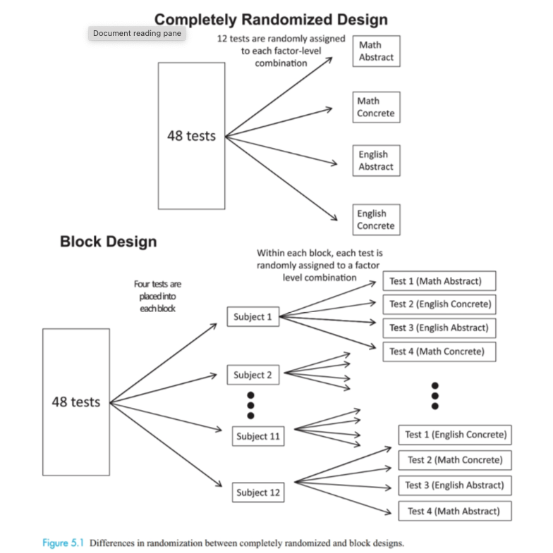

```{r child = "setup.Rmd"}
```

```{r packages, echo=FALSE, message=FALSE, warning=FALSE}
library(tidyverse)
library(janitor)
```

```{r, echo = FALSE, warning = FALSE}
memory <- read_csv("./data/C5 Memory.csv") %>% 
  clean_names()

```

class: middle, center

# Chapter 5: Block, Split-Plot, and Repeated Measures Designs

---

# AE-CH5

+ Navigate to course Github page
+ Open AE-CH5.qmd and copy contents
+ Create new .qmd in your MATH_350 project folder and paste contents from GitHub
+ Render your .qmd

---

# What Influences Memory? 

--

+ This is too broad of a question to be useful in research!

--

+ Don't need to conduct research if answer is known, but good research questions often slightly modify or incorporate a novel idea into previous research

--

+ Memory distractors: anything that can disrupt an individual's ability to memorize

--

+ Examples of memory tasks: recall list of words

--
  + concrete nouns (table, sofa, horse)
  + abstract nouns (importance, fate, sympathy)
  
--

+ Examples of distractors:
  + count backwards from 262 by 3s
  + read a poem

---

## Research design 

+ Factor A: Abstract vs. Concrete word list
+ Factor B: Mathematics vs. Poetry distractor

Each subject read through the list for 20-30 seconds, work through a distractor, and then recall as many words as they can. 

--

Only have access to a limited number of people, so they decide to have each person take all four tests, in random order, with short breaks between tests.

--

This is known as a **within-subjects** design. In general, there will be lots of variability between people, so it's useful when that noise doesn't add to the variation between treatments. 

--

However, this now means each person isn't completely randomized to one of the four treatments - there is a *restriction* on the randomization: that exactly four tests must be assigned to each individual. 

--

Randomization restrictions are utilized to create more efficient designs. That's the focus of this chapter.

---

# Research questions

1. Does the type of word list (abstract or concrete) impact memory?
2. Does the type of distractor (mathematics or poetry) impact memory?
3. Does the type of distractor impact memory differently for different types of word lists?

---

# Elements of a Well-Designed Experiment

Since each person would do all four tests:

+ there needed to be two lists of abstract words and two lists of concrete words (so they didn't see each list twice)
+ there needed to be two math distractors and two poetry distractors
    + E.g. if they've already counted down from 262 by 3s once, it will likely be less distracting (require less mental effort) the 2nd time
    
--

Would take all 4 tests on same day, to control for unwanted variation in sleep, stress, etc.. 

--

Each person is considered a **block**

**Blocking** reduces known, but unwanted, sources of variation between units by arranging units in groups that are similar to one another. This can allow for increased precision in determining whether there is truly a difference between treatments. 

--

Also controlled/held constant: test location, instructions provided, the way words were presented, and background distractions. Restricted population to only be students from one college.

---

```{r, echo=FALSE}

```


---

# Elements of a Well-Designed Experiment

**Random allocation/assignment** - the order in which they take the tests is randomized. Prevents fatigue effect or learning effect from biasing the treatment effect.

--

Note, **random sampling** is different - it's concerned with whether or not randomness was used in recruiting people from the population to be in the sample. 

Often, it's very difficult to have both **random assignment** and **random sampling**. 

**Random sampling** allows claims to be *generalized*

**Random assignment** allows claims to be *causal*

---

## Appropriate Analysis?

Three questions about the design determine the appropriate analysis: 

1. What is the randomization structure? Three primary structures:
    + Completely randomized design, also called factorial design
    + Block design, also called randomized block design
    + Split-plot design, also called a repeated measures design
2. Is each factor crossed or nested?
3. Is each factor fixed or random? 

*See note on page 141 for how terminology differs across disciplines*

--

Describe the design / data collection for the memory experiment if conducted as a *completely randomized design*.

What would the corresponding analytic model look like? What hypotheses would we be testing?

---

# Blocks / nuisance factors

**Nuisance factors** are any factors that may impact the results but are not of specific interest in the study. 

--

Blocking for nuisance factors is a good idea (if they're things that can be controlled)

--

`Student` is a nuisance factor here - we know there is variability between people and their memory ability, but it's not something we're investigating directly. 

--

Because we blocked on students, we should include `Student` in our model to control for that variability. 

`score ~ wordlist*distractor + student`

--

Other examples of blocks:

+ Block by student pre-test score
+ Block by batch of dough, plot of land, or piece of metal that tests are run on

---

# Split-plot design

The 12 students weren't really a random sample of all students at the college. They used majors lists from 4 departments (English, History, Math, and Computer Science), and randomly selected 3 students from each list. 

--

A split-plot design is a block design where the blocks are sampled from distinct populations (this case), or when the blocks are also randomly assigned to a treatment

--

Since `Major` is not an experimental treatment (major it not randomly assigned to students), we must be careful about saying major *caused* any differences we observe. Causal claims can be made about wordlist and distractor type, though. 

---

# Crossed and Nested Factors

Any two factors $A$ and $B$ are **crossed** if every level of $A$ occurs with every level of $B$. 

In the memory study, `wordlist` and `distractor` are crossed. 

In completely randomized designs, all factors of interest are crossed and there are no repeated measures.

$B$ is **nested** in $A$ if levels of $B$ only have meaning within certain levels of $A$. 

  + For example, imagine an experiment that samples two leaves from many trees.
  + There are two leaves, Leaf #1 and Leaf #2, but these only have meaning within the tree they came from. 
  + It wouldn't make sense to average all the "Leaf #1" leaves across all the trees. 

---

# Fixed and Random Factors

In addition to determining whether each factor is crossed or nested, we also need to determine if each factor is fixed or random in order to choose the appopriate analysis.

A factor is **fixed** if the levels are chosen because they are of specific interest in the study. The levels of the fixed factors would be used again by a researcher attempting to replicate the study.

A factor is **random** if the levels tested represent a random sample from some population of possible levels of interest. The levels of a random factor will differ for each researcher repeating the experiment.

In the memory study,

+ `student` is a random factor, because students were ranomdly selected from a population. Those *specific* students weren't of particular interest
+ `wordlist` and `distractor` are considered fixed factors 