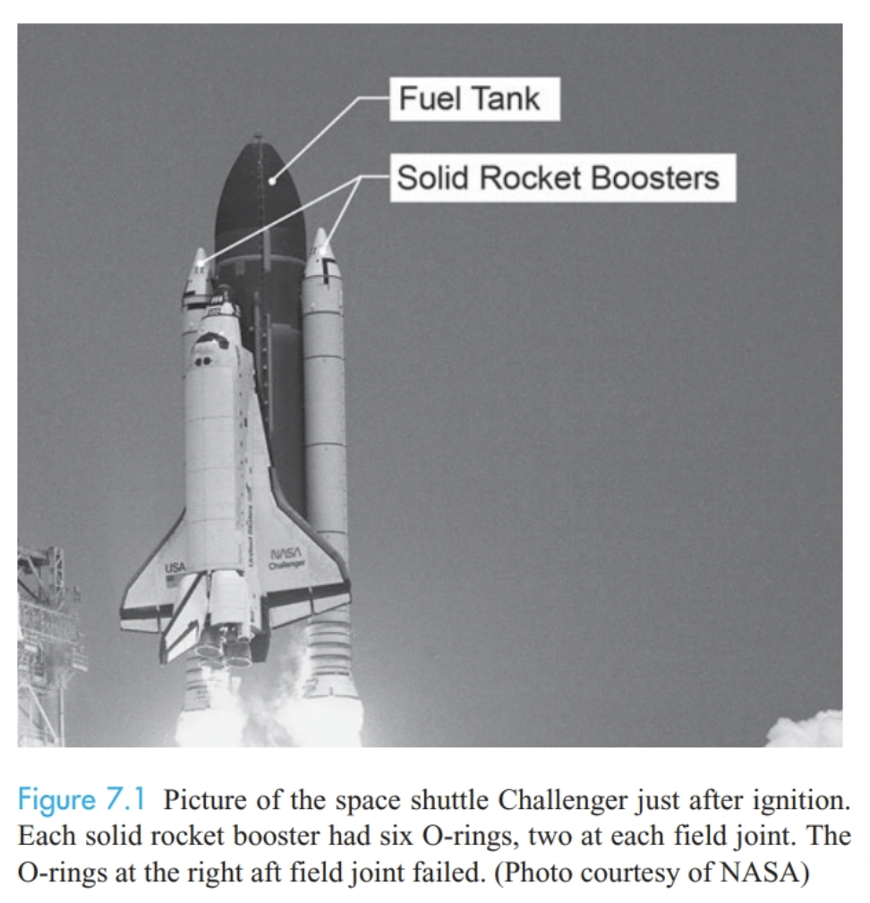
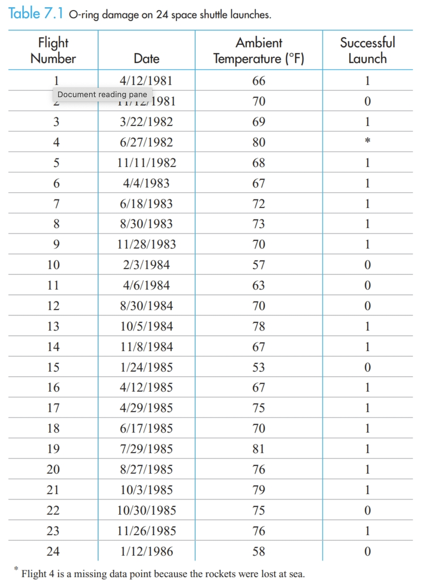
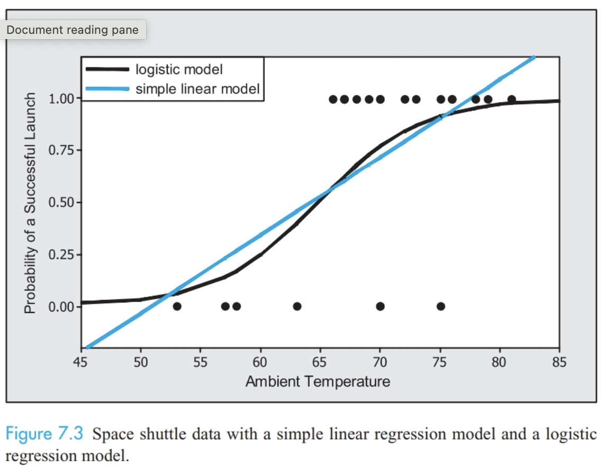

```{r child = "setup.Rmd"}

```

```{r, include = FALSE}
knitr::opts_chunk$set(echo = FALSE, message = FALSE,
                      warning = FALSE)
```

```{r packages, echo=FALSE, message=FALSE, warning=FALSE}
library(tidyverse)
library(janitor)
```

```{r, echo = FALSE, warning = FALSE}
memory <- read_csv("./data/C5 Memory.csv") %>% 
  clean_names()

```

class: middle, center

# Chapter 7: Logistic Regression

---

class: middle, center

# "The best thing about being a statistician is that you get to play in everyone's backyard" 

- John Tukey

---

# AE-CH7

+ Navigate to course Github page
+ Open AE-CH7.qmd and copy contents
+ Create new .qmd in your MATH_350 project folder and paste contents from GitHub
+ Render your .qmd

---

# Space Shuttle Investigation

.pull-left[
January 28, 1986, NASA launched 25th shuttle flight from Kennedy Space Center in Florida. 

73 seconds into flight, external fuel tank collapsed and spilled liquid oxygen and hydrogen. Ignited and killed all 7 crew members on board. 

O-ring seal in the right solid rocket booster failed to isolate the fuel supply.

Tragedy: engineers knew that cold temperatures caused O-rings to become brittle and fail to seal properly. They recommended against launch, but were overruled.

Expected temperature for January 28, 1986 was 31 degrees Fahrenheit. 
]

.pull-right[
```{r}

```
]
---

# Research question & data

.pull-left[
*Did temperature influence the likelihood of an O-ring failure?*

24 prior flights deemed successful by NASA because even though some O-ring damage had occurred, none of it was severe enough to allow gas to escape. 

In `shuttle` data (Table 7.1), launch considered successful if NO O-ring damage occurred.

]

.pull-right[
```{r}

```
]

---

# `shuttle` data, AE #1-2

```{r}
shuttle <- read_csv("./data/C7 Shuttle.csv") %>% 
  clean_names()
glimpse(shuttle)
```

+ Question 1: explanatory and response variables?

+ Question 2: Imagine you're an engineer working for Thiokol Corporation prior to January 1986. Create a few graphs of the data in Table 7.1

---

# Linear vs. Logistic regression

+ Linear = continuous response variable
+ Logistic = dichotomous (binary) response variable

Examples:

+ whether disease is present or absent
+ whether or not a person is a good credit risk for a loan
+ whether or not a high school student should be admitted to a particular college
+ whether or not an individual is involved in substance abuse
+ Others?? 

---

# Linear regression review

"Ordinary least squares regression": 

$$y_i = \beta_0 + \beta_1 + \epsilon_i, \ \ \ i = 1,\dots n$$

$$E(Y_i | x_i) = \beta_0 + \beta_1x_i, \ \ \ i = 1, \dots n$$

$$\epsilon_i \overset{\text{iid}}{\sim} N(0, \sigma^2)$$

## AE-CH7 #3 

Create scatterplot with a least squares regression line for the space shuttle data. Calculate the predicted response $\hat{y}_i = b_0 + b_1x_i$ when temperature = 60 and when temperature = 85 degrees Fahrenheit.

---

# Probability of success

When response is binary, we usually define response to be probability of success rather than 0 or 1. 

That is, let $$
\begin{aligned}
\pi_i &= P(Y_i = 1) = \text{Probability that a launch has no O-ring damage at temperature } x_i \\
&= E(Y_i | x_i) \\
&= \beta_0 + \beta_1x_i
\end{aligned}
$$

Interpret predictions from temperatures of 60 and 85. What's wrong? 

---

# Logistic regression


.pull-left[
Need a function that will restrict output to be between 0 and 1 (to behave like probabilities). 

$$ln\left(\frac{\pi_i}{1 - \pi_i}\right) = \beta_0 + \beta_1x_i$$

+ ln is natural log
+ $\beta_0, \beta_1$ are regression parameters
+ $\pi_i$ is probability of a successful launch for a given temperature $x_i$

The ratio $\pi/(1 - \pi)$ is called the **odds**, so $ln[\pi/(1 - \pi)]$ is called the **log-odds**, or **logistic** or **logit** transformation of $\pi$

***NOTE: in statistics, when we say log, we always mean natural log.***

Solve for $\pi_i$
]

.pull-right[
```{r}

```
]

---

# Model assumptions

For each $x_i$ value, we assume $Y_i \sim Bernoulli(\pi_i)$. This means:

+ Each $Y_i$ is independent
+ $Y_i$ has only two possible outcomes, 0 and 1
+ $P(Y_i = 1 |x_i) = \pi_i$
+ $P(Y_i = 0 | x_i) = 1 - \pi_i$
+ For any given $x_i$ value, the probability of success is constant. 


--


## Recap:

Simple linear regression model with binary response: $$y_i = \pi_i + \epsilon_i = \beta_0 + \beta_1x_i + \epsilon_i$$

Logistic regression model with binary response:
$$y_i = \pi_i + \epsilon_i = \frac{e^{\beta_0 + \beta_1x_i}}{1 + e^{\beta_0 + \beta_1x_i}} + \epsilon_i$$


---

# Generalized Linear Models (GLMs)

Logistic regression is a special case of a **Generalized Linear Model**, which expands linear regression to cases where normal assumptions do not hold. 

--

All GLMs have three components:

1. A **linear predictor**, e.g. $\beta_0 + \beta_1x_i$. Can have many explanatory variables, including interaction terms

--

2. A **random component** where each error is assumed to be independent. GLMs do NOT assume they are normally distributed, and do NOT require the variability of the errors to be constant.

--

3. A **link function** that fits the expected response value to a linear predictor. E.g. the link function for logistic regression is $ln(\pi/(1-\pi))$

--

The link function depends on the distribution of the response variable. In logistic regression, the response variable is binary, so a Bernoulli distribution is assumed. 

Other options: gamma, Poisson, etc. 

For linear regression with a normally distributed response, the link function is simply the identity function. I.e., no transformation is needed for OLS. 

---

# Maximum Likelihood Estimation

$$y_i = \pi_i + \epsilon_i = \frac{e^{\beta_0 + \beta_1x_i}}{1 + e^{\beta_0 + \beta_1x_i}}$$

Even though logistic regression gets us the S-shaped curve (restricted to 0-1) that we want, the error terms are not constant or normally distributed, so we can't use OLS for hypothesis tests and confidence intervals of $\beta_0$ or $\beta_1$

Maximum Likelihood Estimation (MLE) is another way of deriving estimates for parameters (e.g. $\beta_0$ and $\beta_1$). In this class, we won't focus on the derivations but will just have software do the MLE for us. 

--

```{r, echo = TRUE, eval = FALSE}
glm(success ~ temperature, #model formula, just like lm()
    family = "binomial", #distribution & link function specification - see ?family for options
    data = shuttle)
```

### AE #5 - 6

---

# Interpreting Logistic Regression Models

Interpretation often done in terms of odds of success.

When the temperature is 59&deg;F, the odds of a successful launch with no O-ring damage are $$\frac{\hat{\pi}}{(1 - \hat{\pi})} = \frac{0.2066}{1-.2066} = 0.2605 \approx 0.25 = \frac{1}{4}$$

Thus, at 59&deg;F we say the odds of a successful launch are about 1 to 4. 

---

# Slope interpretation

$$odds = \frac{\pi_i}{(1 - \pi_i)} = e^{\beta_0 + \beta_1x_i} = e^{\beta_0}(e^{\beta_1})^{x_i}$$

Thus, as $x_i$ increases by 1, $$e^{\beta_0}(e^{\beta_1})^{x_i + 1}=e^{\beta_0}(e^{\beta_1})^{x_i}(e^{\beta_1})$$

So, increasing $x_i$ by 1 unit in a logistic regression model, increases the predicted odds by a factor of $e^{\beta_1}$. 

In shuttle example, if temperature increases by 1 degree, we increase the odds of a successful launch by $$e^{b_1} = e^{0.232} = 1.2613 \text{ times}$$

### AE #8 - 11

---

## Wald's test

Wald's test for logistic regression coefficients is similar to a one-sample Z-test

$$H_0: \beta_1 = 0 \text{ vs. } H_A:\beta_1 \neq 0$$

$$Z = \frac{b_1 - 0}{se(b_1)}$$

where $b_1$ is the MLE of $\beta_1$ and $se(b_1)$ is its standard error. $b_1$ is asymptotically normal, so $Z \sim N(0,1)$ when sample size is large. Some textbooks and software will instead use $Z^2 \sim \chi^2_{1}$, but the tests are equivalent. 

Compute $Z$ for this data, and draw a conclusion.

---

## CI for odds ratio

$$\left(e^{(b_1 - Z^*se(b_1))}, e^{(b_1 + Z^*se(b_1))}\right)$$

When $\beta_1 = 0$, then the odds ratio $e^{\beta_1} = 1,$ the odds of success for temperature $x_i$ are the same as the odds of success for any other temperature. 

Compute the confidence interval for this data, and interpret it.

--

When a 95% CI for the odds ratio does not contain 1, we...

--

### AE #12 - 13

---

# The Likelihood Ratio Test

The **likelihood ratio test (LRT)** assesses the adequacy of a full model (of interest) and restricted log-likelihood models. 

--

+ The **full model** (or unrestricted model) contains all parameters under consideration in the model (e.g. in this case, $\beta_0$ and $\beta_1$) 

--

+ The **restricted model** (or reduced model) is a model with fewer terms than the full model 

--

+ If the restricted model contains no explanatory variables, this is called the **null model**

--

+ If the full model has a significantly better fit (the expected values are closer to the observed values) than the restricted model, we reject $H_0: \beta_1 = 0$ and conclude that $H_A: \beta_1 \neq 0$

---

# The Likelihood Ratio Test

Restricted model: $$\pi_i = \frac{e^{\beta_0}}{1 + e^{\beta_0}}$$

Full model: $$\pi_i = \frac{e^{\beta_0 + \beta_1x_i}}{1 + e^{\beta_0 + \beta_1x_i}}$$

When $H_0$ is true, can be shown that 

$$G = 2\times \text{log-likelihood(full model)} - 2\times \text{log-likelihood(restricted model)}$$
follows a $\chi^2_{df}$ distribution, where degrees of freedom are the number of parameters in the full model minus the number of parameters in the restricted model. 

The G-statistic measures the difference between the fits of the restricted and full models. 

---

# LRT in R

R output gives the **null deviance** = $K - 2\times \text{log-likelihood(restricted model)}$ and **residual deviance** = $K - 2\times \text{log-likelihood(full model)}$, where $K$ is a constant, so G-statistic can be calculated as null deviance - residual deviance. 

```{r, echo = FALSE}
m2 <- glm(success ~ temperature, 
    family = "binomial", 
    data = shuttle)
```


```{r}
summary(m2)
```

---

# Wald vs LRT

+ LRT is preferable to Wald in small sample sizes
+ In general, recommend about n = 100. Make sure to state p-values are approximate if dealing with small sample sizes
+ Wald can have one-sided alternative as well as non-zero hypothesized values

---

# What can we conclude?

## AE #14
