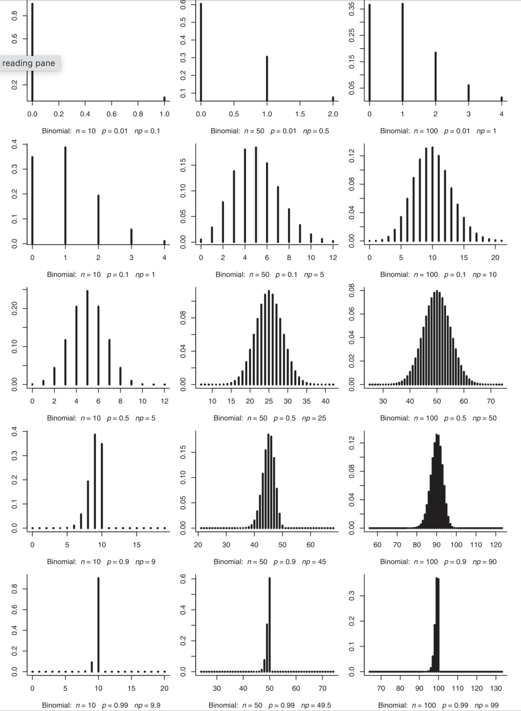
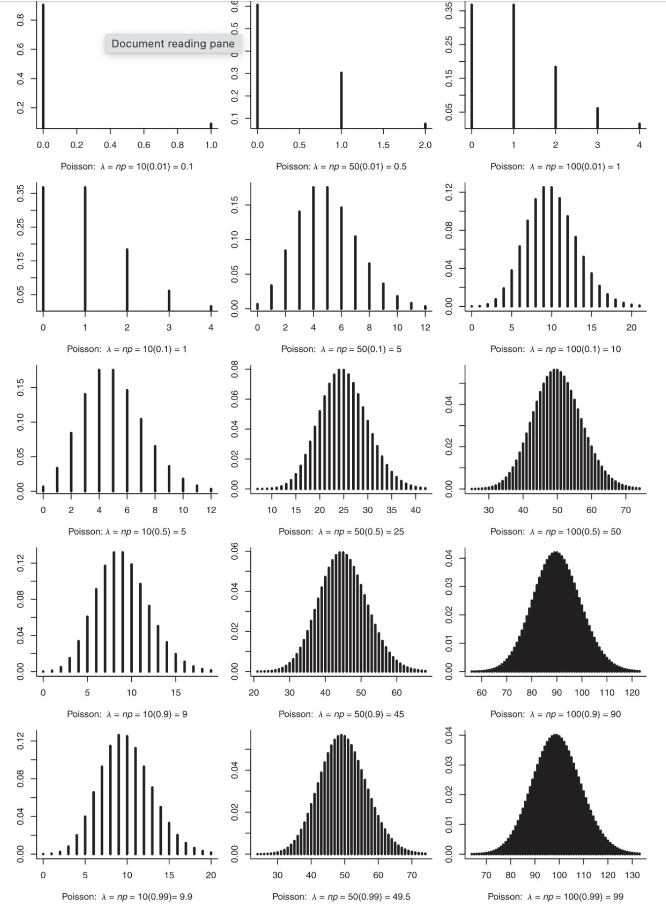
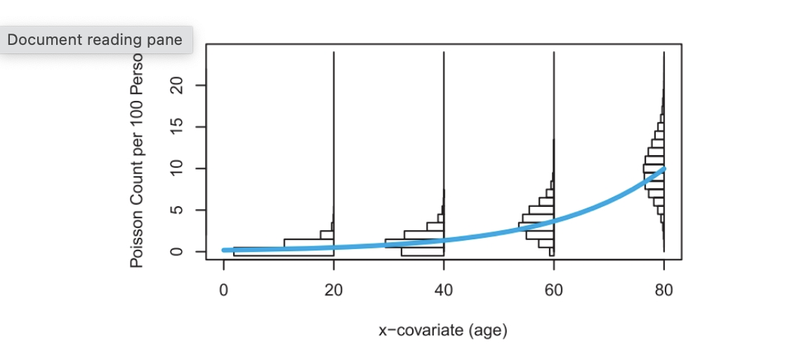

```{r child = "setup.Rmd"}

```

```{r, include = FALSE}
knitr::opts_chunk$set(echo = FALSE, message = FALSE,
                      warning = FALSE)
```

```{r packages, echo=FALSE, message=FALSE, warning=FALSE}
library(tidyverse)
library(janitor)
library(broom)
```

```{r, echo = FALSE, warning = FALSE}
cancer <- read_csv("./data/C8 CancerCluster.csv") %>% 
  clean_names()

```

class: middle, center

# Chapter 8: Poisson Regression

---

class: middle, center

# "Using statistics is no substitute for thinking about the problem" 

- Douglas Montgomery (Ch 1)

---

class: middle, center

# "In theory, there's no difference between theory and practice. In practice, there is." 

- Yogi Berra (Ch 2)


---

class: middle, center

# "Essentially, all models are wrong; some are useful." 

- George Box (Ch 3)


---

class: middle, center

# "However beautiful the strategy, you should occasionally look at the results." 

- Winston Churchill (Ch 4)


---

class: middle, center

# "Do not put your faith in what statistics say until you have carefully considered what they do not say." 

- William Whyte Watt (Ch 5)

---

class: middle, center

# "If you can't solve a problem, then there is an easier problem you can solve: find it." 

- George Polya (Ch 8)

---

# AE-CH8 / HW-CH8

+ Navigate to course Github page
+ Open HW-CH8.qmd and copy contents
+ Create new .qmd in your MATH_350 project folder and paste contents from GitHub
+ Render your .qmd

---

# Toxic Waste Investigation


.pull-left[
Suppose toxic waste is discovered in soil samples in the neighborhood where you grew up, and a company that is now out of business has been confirmed as the source of the waste. 

More worrisome, you've heard a number of your childhood friends have been diagnosed with cancer.

Question: How many people have been diagnosed with cancer, and does this represent an unusually large number of cases? 

Movie *A Civil Action* (has statistician as lead character?! and starring John Travolta?!) tells the true story of investigating childhood leukemia cases in Woburn, Massachusetts.

]

.pull-right[

```{r, out.height="20%"}

```

```{r, out.height="20%"}

```

]
---

# Count data

+ Outcome of interest is a count of occurrences

--

+ Must also consider the **rate**, also called the **incidence rate**, which is a count of the events divided by some measure of that unit's exposure. 

--

+ **Exposure** is usually some measure of time, space, unit of matter, or group size. 

--

+ **Person-years** is a measure of exposure: the total number of years all people have been exposed (total # of people x # of years at risk)

--

+ The rate depends therefore on both the # of people in the area, and the length of exposure

--

+ **Cancer incidence rate** = cacner rate per 100,000 person-years (cancer rate x 100,000)

---

# Randolph, Massachusetts

In spring 1984, 67 cases of cancer were reported among people living in 325 homes in the Bartlett-Green Acres neighborhood

--

Concerned neighbors asked scientists at nearby Harvard School of Public Health to advise them on their cancer risk. 

--

AE #1: If the 325 homes have an average of 3.5 people in each home, then based on the 67 reported cases, what proportion of people reported a cancer diagnosis?

--

AE #2: If we also assume people have lived in the community for an average of 25 years each, then what is the total number of person-years at risk in the community?

--

AE #3: What is the observed cancer rate in Randolph? The cancer incidence rate? 

---

# Due to chance?

Number of cancer cases vary even among neighborhoods with the same person-years of exposure and same underlying environmental conditions. 

Even rare events (like a cluster of cancer cases) can occur just by chance.

--

Could this community actually be like similar communities in terms of its exposure to cancer-causing agents and this large number of observed cases just be due to chance variation? Or is the number of cases in Randolph so large that it is difficult to argue that chance variation is a reasonable explanation? 

--

$$H_0: \text{ rate of cancer in Randolph is the same as the nationwide incidence rate}$$
$$H_A: \text{Randolph > National}$$
--

Nationwide incidence rate was 326 cases per 100,000 people in a year: 326/100,000 = 0.00326 cases per person-year

--

Can find expected count of cancer cases (i.e., average number of cases expected) when $H_0$ is true by:

$$\text{expected count = exposure } \times \text{rate}$$
--

AE #4, #5

---

# Key Concept

When comparing counts accross groups, important to consider the background exposure:

+ group size
+ length of time exposed
+ and/or distance from the alleged site

--

Statistical epistemology: robustness checks. How far off would our estimates have to be in order for us to draw a different conclusion? 

---

# Models for count data

Expected counts only tell us the average number of cases for neighborhoods with the same person-years of exposure. To determine how unusual 67 cases is, we need a statistical model. 

Simplifying assumptions:

+ people obtain cancer diagnoses independently of one another
+ each person randomly selected in a given years as a probability of 0.00326 of being diagnosed with cancer that year

AE #6 - 10

---

# Harvard conclusions

Started with an analysis very much like the one we just did, and decided further investigation was warranted. 

--

Decided to consider the 20-year exposure period from 1964 to 1984.

By examining census data and conducting interviews - estimated that the number of persons at risk was 2314 and mean duration of residence was 11.5 years. 

--

$$2314 \times 11.5 \times 0.00326 = 86.75 \text{ expected cases}$$

--

Conclusion: nothing out of the ordinary. This is a common outcome after expert investigation. 

--

Debate over how much funding and resources should be allocated to investigating alleged disease clusters. 

---

# Binomial Model for Count Data

Recall, when $Y \sim binomial(n,p)$

$$P(Y=y) = {n \choose y}p^y(1-p)^{n-y}, \ \ \ y = 1, \dots , n$$

$$E(Y) = np$$

$$V(Y) = np(1-p)$$

--

Number of trials (opportunities for exposure) is 1138 x years. Probability of "success" (cancer diagnosis) for each trial (person-year) is 0.00326. 

--

Can use binomial distribution to compute p-value directly, without simulations.

```{r, echo = TRUE}
pbinom(67, size = (1138*12.5), prob = 0.00326, lower.tail = FALSE)
```

--

Compute rough CI using normal distribution - see Figure 8.2 for when this is appropriate. 


---

# Poisson Model for Count Data

Binomial model requires that $n$ be an integer. However, time exists in a continuous interval, so an integer value for exposure might not be the most precise. We also had to round number of persons in the previous example: 325*3.5 = 1137.5.

Poisson model allows for this flexibility:

$$P(Y = y) = \frac{e^{-t\theta}(t\theta)^y}{y!}, \ \ \ y = 0,1,2,3,\dots,$$

where $\theta$ is the cancer rate (i.e., number of occurrences per unit of exposure, previously expressed as $p$)

--

Cautionary note on pg. 256 about parameterization. 

--

$$E(Y) = t\theta = \lambda$$

$$V(Y) = t\theta = \lambda$$
---

# Which model?

Similar when $p < 0.02$ and $np > 5$.

.pull-left[
```{r}

```

]

.pull-right[
```{r}

```

]

---

# Which model?

+ Binomial if integers not a problem
+ Poisson $\approx$ binomial when $np > 5, p < 0.02$
+ When number of counts is large, can use normal & OLS
+ Use Poisson when number of counts is small and when variance is approximately equal to mean

---

# Adding covariates

Age influences likelihood of getting cancer, but probably doesn't increase at a constant rate

--

For younger people (0 - 30), rate is probably constant, while for older people (60+), cancer rate probably rises fairly steeply from the youngest to the oldest in this group.

--

Can model with exponential growth

$$\theta = e^{\beta_0 + \beta_1 x},$$

where $\theta$ is the cancer rate and $x$ is the age (in years). 

```{r}

```

---

# Poisson regression

Exponential relationship between expected cancer count $E(Y) = t\theta = \lambda$ and covariate age can be expressed as:

$$log[E(Y)] = log(t\theta) = log(\lambda)= log(t \times e^{\beta_0 + \beta_1 x}) = log(t) + \beta_0 + \beta_1x$$

--

$log(t)$ is called the "offset", which allows for situations where not every observed count has the same level of exposure

--

Note, we can re-write the model as 

$$log(\lambda/t) = \beta_0 + \beta_1x$$

In other words, instead of modeling counts, the offset term actually allows us to model rates, such as counts per person-year. 

---

# GLM

Poisson regression is another form of Generalized Linear Model. Recall they all have the basic form:

$$g[E(Y)] = g(\mu) = \beta_0 + \beta_1x,$$

where $E(Y) = \mu$ is the mean for the probability model for the data and $g$ is the link function. 

--

For binary data (logistic regression), most common link function was $$log\left[\frac{\mu}{1 - \mu}\right]$$

For count data (Poisson regression), most common link function is $$log(\mu)$$

Sometimes poisson regression is called more specifically **Poisson log-linear regression model**

---

# Key concepts

OLS assumes equal variance of the error terms, meaning $V(X) = \sigma^2$ is constant and does not depend on $x$.

In Poisson model, mean = variance, so as mean count increases, variance in observed counts will also increase. This is a direct violation of OLS. 

```{r, fig.height="100%"}

```

---

# Key Concepts

GLM describes relationship between the mean of a non-normally distributed response variable and one of more covariates. 

--

A link function relates the mean response to a linear combination of the covariates. 

--

In modeling rates, the offset is used to incorporate different exposure levels for the observations

---

# Poisson model: AE #15 - 16

Using only the BGA location from the `cancer` data, fit model $$log(\hat{\lambda}) = log(t) + b_0 + b_1x$$ 

```{r, echo = TRUE}
bga_data <- cancer %>% 
  filter(location == "BGA")

m1 <- glm(cases ~ median_age + offset(log(person_years)), 
          data = bga_data, family = "poisson")
tidy(m1)
```

---

# Interpreting Poisson regression

$$log(\lambda/t) = \beta_0 + \beta_1x$$
$$\lambda/t = e^{\beta_0 + \beta_1x}$$

$e^{\beta_0}$ is the cancer rate when x = 0, and $e^{\beta_1x}$ is the multiplicative change in the cancer rate associated with each unit increase in x.

--

Cancer rate for age group with median age of 62 is $$e^{(62-51.5)\times0.049} = 1.67$$ times as high as the rate for the next youngest age group with a median age of 51.5.

--

When the covariance increases by $c$ units, the mean rate will be multiplied by $e^{c\beta_1}$

---

# HW-CH8

+ AE #17 - 34 (read 8.8 - 8.11)
+ AE #50 - 59 (read 8.14 + Chapter Summary)

