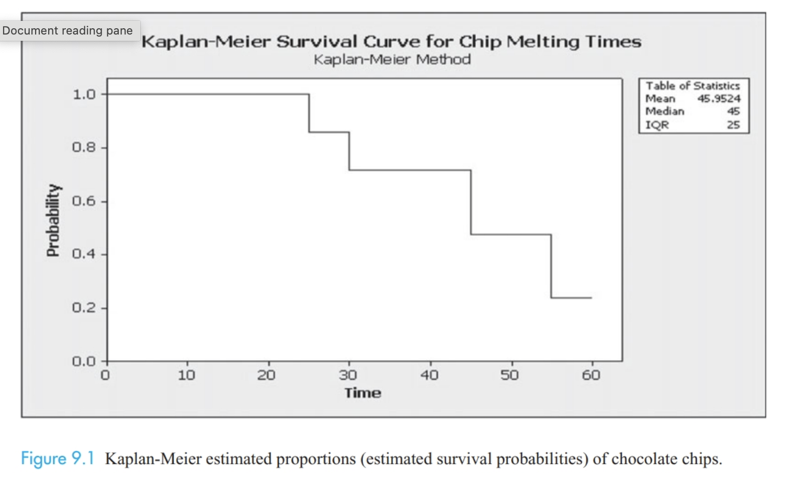
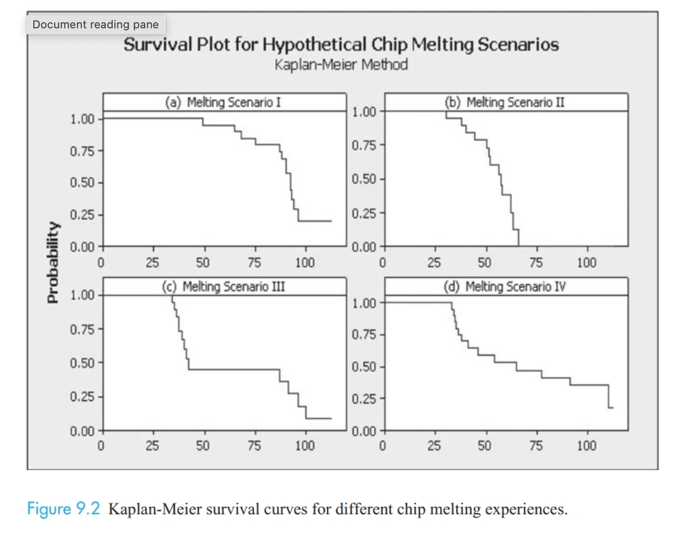
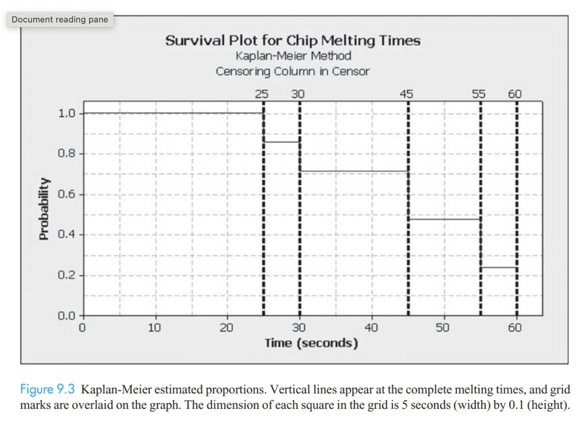
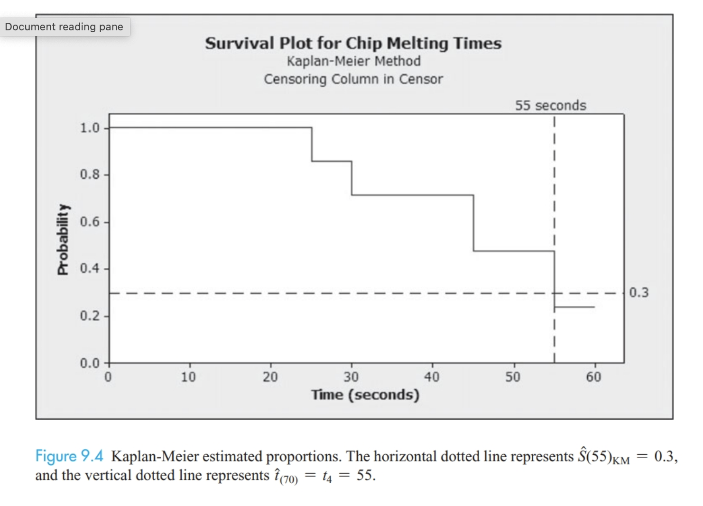

```{r child = "setup.Rmd"}

```

```{r, include = FALSE}
knitr::opts_chunk$set(echo = FALSE, message = FALSE,
                      warning = FALSE)
```

```{r packages, echo=FALSE, message=FALSE, warning=FALSE}
library(tidyverse)
library(janitor)
library(broom)
library(ggsurvfit)
library(survival)
```

```{r, echo = FALSE, warning = FALSE}
melt <- read_csv("./data/C9 MeltingChipsJS.csv") %>% 
  clean_names()
melt <- melt %>% 
  mutate(complete = censor,
         censored = if_else(complete == 0, 1, 0)) %>% 
  select(-censor)
```

class: middle, center

# Chapter 9: Survival Analysis

---

class: middle, center

# "Far better an approximate answer to the right question, which is often vague, than the exact answer to the wrong question, which can always be made precise." 

- John Tukey (Ch 9)

---

# AE-CH9

+ Navigate to course Github page
+ Open AE-CH9.qmd and copy contents
+ Create new .qmd in your MATH_350 project folder and paste contents from GitHub
+ Render your .qmd

---

# Survival analysis

Response variation is the *time* until a target event of interest.

+ death (medicine / public health)
+ drug relapse (public health)
+ college graduation (education)
+ time until drivers blocked in traffic honk their horn (sociology or psychology)
+ age at which first alcoholic drink is taken (public health)
+ time until formerly incarcerated person is rearrested (criminology)
+ time until a light bulb burns out (manufacturing)

Others? 

--

Depending on the context, this time might be considered a **failure time**, **survival time**, or **time-to-event random variable**. 

--

Unit experiencing the event may be living (e.g. person or animal) or inanimate (e.g. light bulb, computer)

---

# Melting chocolate

Chocolatiers and food scientists are obsessed with factors that affect the melting process of chocolate!

--

Brief experiment: how long does it take for chocolate chips to melt?

--

Restriction - we have limited time, will need to end our data collection after 60 seconds.

What are the potential problems with this? 

--

Goals

+ Estimate the proportion of chips that remain unmelted beyond a specific point in time
+ Estimate the average time to takes for white or milk chocolate chips to melt
+ Determine if the type of chip is related to the chip melting experience
+ For chips that have not melted by a particular time, at what rate are they melting in the next "instant" of time? 

---

# Experiment

Due to limited sample size (and time), we're going to just test one for fun, but we'll use the `MeltingChipsJS` data provided by the book.

+ Randomly assign each student to receive a white or milk chocolate chip

--

+ When instructed, place chocolate chip on your tongue and press it to the roof of your mouth

--

+ Record the amount of time until it completely melts (how are we defining this?)

--

+ If chip is not melted, record `time` of 60, and an indicator variable `censor` will indicate whether the observation was complete (1) or incomplete (0)

--

+ Data should include chip `type`, `time`, and `censor`.

--

+ If chips are accidentally swallowed, `time` should be the time when swallowed, and the data should be recorded as incomplete. 

---

# Survival data - key concept

Response variable in a survival analysis is the time until the event of interest occurs. Survival analysis methods are appropriate for data from experiments or studies that possess:

+ a **well-defined event** of interest

--

+ a **clearly defined beginning of time** (no individual has experienced event yet)

--

+ a **meaningful scale** for measuring time (e.g. seconds, minutes, days, weeks, etc.)

--

Time-to-event data are *different* from time series data, which are measurements on the same observational units collected at different points in time.

---

# Incomplete Event Times: Censoring

Common in survival analysis is that some event times are **incomplete**; we have only partial information about the time until the event of interest occurs.

--

+ Times known exactly = **complete**

--

+ **Right censoring** = observation begins at start time and ends before the event of interest is observed

  + Can occur from dropping out OR study ending before event

--

+ **Left censoring** = event of interest is known to have occurred before the study began

--

+ **Interval censoring** = event of interest is known to have occurred between two time points, but the precise time is not known

--

Incomplete observations can introduce systematic error (bias) into estimated quantities (e.g. mean, median) if not handled appropriately. 

## AE #2-3

---

# The Survival Function

Primary function used to characterize the values of a time-to-event random variable $T$ is the **survival function** $S(t)$

$$S(t) = P(T > t),$$

which gives the probability a randomly selected individual in the population will survive (not experience the event of interest) beyond time $t$. In other words, the proportion of individuals who haven't experienced event of interest by time $t$. 

--

What is interpretation of $S(45)$ for chocolate chip melting example? 

--

What is $S(0)$ for all survival analyses?

--

Is $S(t)$ an increasing or decreasing function? 

--

Important: $S(t)$ does NOT give the probability that an individual experiences the event at time $t$. 

---

# The Empirical Survival Function

In order to fully know $S(t)$, we would need to know the melting times of the entire population of chips, or know the exact probability distribution of $T$.

--

In practice, we have a sample of survival times, and we need to find an estimator for $S(t)$. 

This is analogous to $\mu, \overline{x}$ or $\beta_1, b_1$ issue. 

--

Potential estimator:

$$\hat{S}(t)_E = \frac{\text{# of chips that haven't melted after t seconds}}{\text{Total # of chips in the sample}}$$

Hypothetical data (Table 9.1): 

| Student | 1 | 2 | 3 | 4 | 5 | 6 | 7 |
|---------|---|---|---|---|---|---|---|
| Time | 35 | 30 | 60 | 45 | 25 | 55 | 30

AE #4: Compute $\hat{S}(25)_E$, $\hat{S}(30)_E$, $\hat{S}(40)_E$, $\hat{S}(60)_E$

---

# AE #5 - Censored data

Now imagine some of that data was censored.

| Student | 1 | 2 | 3 | 4 | 5 | 6 | 7 |
|---------|---|---|---|---|---|---|---|
| Time | 35+ | 30 | 60+ | 45 | 25 | 55 | 30+

Compute $\hat{S}(45)_E$ using two approaches:

+ Assume it's all complete data (ignore censoring)
+ Eliminate all censored observations and estimate based on complete cases only (complete-case-analysis)

--

What implications do both approaches have? 

---

# Kaplan-Meier Estimator

When a dataset contains incomplete data, the best estimator of the survival function is the **Kaplan-Meier** estimator, $\hat{S}_{KM}$. Usually computed via software, but we'll discuss the logic, which involves breaking the data into a series of time intervals.

--

+ Order the *complete* event times from the smallest to largest

--

+ Label the smallest complete time as $t_1$, the next smallest as $t_2$, etc.

--

+ Number of *complete* cases is denoted by $m$, which is less than or equal to $n$, the total number of observations (complete + incomplete)

--

+ $t_1$ through $t_m$ used to define time intervals 

    + By convention, the $0^{th}$ interval begins at time $t_0 = 0$ and ends just prior to the time when the first event occurs. Given by $[0,t_1)$
    + $[t_i, t_{i + 1})$, for $i = 1, 2, \dots m - 1$
    + $[t_m, t_n)$ if largest time is censored
    + $[t_m, t_m]$ is largest observed time is complete
    
---

# AE #6 - 8

| Student | 1 | 2 | 3 | 4 | 5 | 6 | 7 |
|---------|---|---|---|---|---|---|---|
| Time | 35+ | 30 | 60+ | 45 | 25 | 55 | 30+

+ Question 6: what is $m$? List $t_1$ through $t_m$

--

+ Question 7: First two intervals are [0, 25) and [25,30). Write out the rest. Note: incomplete times are ignored in creating intervals. 

--

+ Question 8: Determine $d_i$, the number of melted chips in each interval, and $n_i$ the number of chips at risk of melting in each interval (all chips that have not yet melted or been censored at start of interval), for $i = 0,1,2,3,4$

---

# AE #9 - 12

The conditional probability of experiencing the event in the $i$th time interval, given that the event has not occurred by the start of the interval is given by: 

$$\hat{p}_i = \frac{d_i}{n_i}$$

--

$1 - \hat{p}_i$ is the probability of *not* experiencing the event (i.e., of *surviving*) through the $i$th time interval, given that the individual has not experienced the event prior to the $i$th interval. 

--

+ Question 9: What is the value of $\hat{p}_0$? Interpret this value.

--

+ Question 10: Show that about 14% of the chips that have not melted by the 25th second will melt between the 25th and 30th second.

---

# Kaplan-Meier Estimator

The final step in getting the Kaplan-Meier estimated probabilities is to multiply together each conditional probability of surviving through the $i$th time interval to get the *unconditional* probability of surviving through the $i$th time interval.

--

The Kaplan-Meier estimator of the survival function is given by 
$$\hat{S}_{KM} = \prod_{t_i \leq t} (1 - d_i/n_i)$$

--

Recall probability rules from 361. Let $A_i$ be any event that occurs after interval $i$.

+ $\hat{S}_{KM}(25) = (1 - \hat{p}_1)(1 - \hat{p}_0)$ is an estimate of $P(A_1) = P(A_1 \cap A_0) = P(A_1 | A_0)P(A_0)$

--

+ $\hat{S}_{KM}(30) = (1 - \hat{p}_2)(1 - \hat{p}_1)(1 - \hat{p}_0)$ is an estimate of $P(A_2) = P(A_2 \cap A_1 \cap A_0) = P(A_2 | A_1)P(A_1 | A_0)P(A_0)$

---

# AE #11 - 17

Questions 11 - 13: Fill in the rest of the table

| Interval $i$ | Time interval | $n_i$ | Number censored | $d_i$ | $\hat{p}_i$ | $1 - \hat{p}_i$ | $\hat{S}(t)_{KM}$ |
|-----|-----|-----|-----|-----|-----|-----|-----|
|0 | [0, 25) | 7| | | | | |
|1 | [25, 30) | 7| | | | | |
|2 | [30, 45) | 6| | | | | |
|3 | [45, 55) | 3| | | | | | 
|4 | [55, 60) | 2| | | | | |

--

Question 14: What is the estimate for $S(45)$ in the table? Interpret this value. 

--

Question 15: Estimate the proportion of chips that have melted by 35 seconds.

--

Question 16: Estimate the proportion of chips that have not melted after 50 seconds.

--

Question 17: Skip, but note that when there is no censoring, the KM estimator will match the empirical survival function.

---

# Kaplan-Meier Curves

Plots the values of $\hat{S}(t)_{KM}$ against the complete event times $t_1, t_2, \dots, t_m$.

```{r}

```

Question 18: Compare values in table to those in the figure. How would the KM curve change if the largest observed melting time were not censored?

---

# Survival analysis in R - AE #19

The package `ggsurvfit` allows us to plot K-M curves in R. 

The function `Surv` (from `survival` package, automatically loaded with `ggsurvfit`) converts time & censoring data to a "survival object" that is then used as the response variable in a model. 

`survfit2` fits the model

`ggsurvfit` plots the curve

```{r, echo = TRUE, warning = FALSE, eval = FALSE}
#install.packages("ggsurvfit")
library(ggsurvfit)

response <- Surv(time = melt$time,
                 event = melt$complete)

survfit2(response ~ 1 + type, 
         data = melt) %>% 
  ggsurvfit() +
  labs(
    x = "Seconds",
    y = "Overall survival probability"
  )
```

---

# K-M curves

Describe what's going on in the four different (hypothetical) scenarios.

```{r}

```

---

# Estimating the Mean Survival Time

May seem odd that we talked about fitting the model before descriptive statistics, but that's because the survival probabilities are needed to estimate the descriptive statistics. 

$$\hat{\mu} = \sum_{i = 0}^{m-1}\hat{S}(t_i)_{KM}(t_{i + 1} - t_i) + \hat{S}(t_m)_{KM}(t_n - t_m)$$

Recall $\hat{S}(t_0)_{KM} = 1$, and note that the last term (outside the sum) will be 0 when the largest observed time is complete (i.e. $t_m = t_n$). 

--

This can be thought of as a weighted average, where the K-M curve estimates act as weights (probabilities) for the time-to-event intervals. 

---

# Mean survival time = area under curve

Question 21: Use this figure to visually estimate the mean survival time.

```{r}

```

---

# Estimating percentiles

$$\hat{t}_p = \text{ smallest complete event time } t_i \text{ in the sample such that } \hat{S}(t_i)_{KM} \leq 1 - \frac{p}{100}$$

For example, 70th percentile is 55. 

```{r}

```

---

# Estimation in R - AE #25

```{r, echo = TRUE, eval = FALSE}
response <- Surv(time = melt$time,
                 event = melt$complete)
m1 <- survfit2(response ~ 1 + type, 
         data = melt)
print(m1, rmean = 75) #will give mean and median
```

```{r, eval = FALSE}
#cutting floor

results <- tidy_survfit(m1)
white <- results %>% 
  filter(strata == "White") %>% 
  mutate(i = 0:(nrow(.) - 1),
         interval_length = lead(time, order_by = time) - time)

if(white$n.censor[nrow(white)] == 0){
  m = nrow(white) - 1
} else{
  m = nrow(white) - 2
  white$interval_length[m + 2] = white$time[m + 2] - white$time[m + 1]
}

mu_hat <- min(white$time)*1 + sum(white$interval_length*white$estimate) 

white %>% 
  summarize(est_mean = sum(estimate*interval_length))
m <- nrow(white)
sum(white$estimate[1:(m-1)]*white$interval_length[1:(m-1)]) + white$estimate[m]*white$interval_length[m]
  
```


---

# CIs for surival probailities

Just like any other sample statistic, the estimates of survival probabilities are subject to **sampling variability.**

The approximate $100(1 - \alpha)\%$ confidence interval for $S(t) = P(T > t)$ at a fixed time $t$ is given by

$$\hat{S}(t)_{KM} \pm Z_{\alpha/2}SE(\hat{S}(t)_{KM}),$$

where $$SE(\hat{S}(t)_{KM}) = \hat{S}(t)_{KM}\sqrt{\left(\sum_{t_i \leq t}\frac{d_i}{n_i(n_i - d_i)}\right)}$$

Add `add_confidence_interval()` layer to `ggsurvfit()`.  

`summary(m1)` and `tidy(m1)` will provide the SEs for each estimated probability. 

# AE 26, 29 - 31

```{r, eval = FALSE}
summary(m1)
tidy(m1)

ggsurvfit(m1 %>% filter(type)) +
  labs(
    x = "Seconds",
    y = "Overall survival probability"
  ) + 
  add_confidence_interval()
```

---

# Comparing survival functions

Log-rank / Wilcoxen test 

$$H_0: S_1(t) = S_2(t)}$$

for all times $t$ during which at least one of the groups has at least one subject at risk of experiencing events

$$H_A: S_1(t) \neq S_2(t)$$

for at least one time $t$. 

The R function `survdiff` implements a more sophisticated mix of hte log-rank / Wilcoxen test. On homework, don't need to conduct them separately. 

```{r, echo = TRUE, eval = FALSE}
survdiff(response ~ type, data = melt)
```

## AE #36
